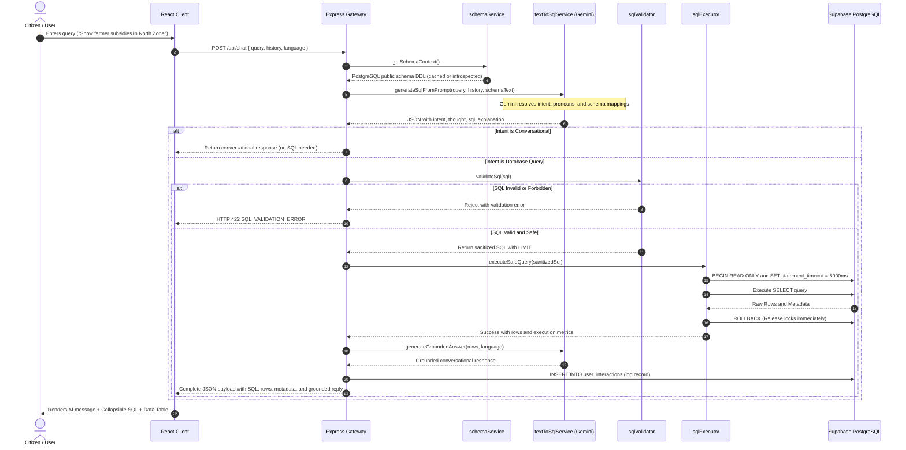
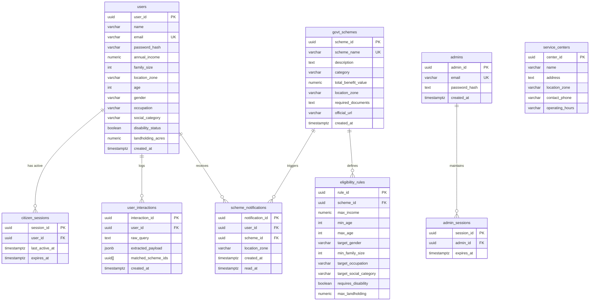

# CivicHelper AI — Component-Wise System Architecture

This document provides the comprehensive, component-wise architecture specification for **CivicHelper AI** (Intelligent Community Resource Chatbot). It details each architectural layer, inter-component communication, security boundaries, database schemas, and AI execution pipelines.

---

## 1. High-Level Architectural Topology

CivicHelper AI operates on a modern 3-Tier decoupled architecture:
1. **Client Tier**: React 18 + Vite SPA with Tailind CSS v4, Framer Motion, and Client-Side i18n.
2. **Application Tier**: Node.js & Express REST API with dual-engine matching (Google GenAI Text-to-SQL + Deterministic Parametric SQL), session management, and Brevo notification services.
3. **Data Tier**: Cloud-hosted Supabase PostgreSQL (AWS Seoul) connected via IPv4 Session Pooler (port 5432).

```mermaid
flowchart TB
    subgraph ClientTier["CLIENT TIER (React 18 + Vite SPA)"]
        direction TB
        UI_Home["Home Landing View"]
        UI_Auth["Citizen Auth & Demo Login"]
        UI_Intake["Demographic Profile Intake"]
        UI_Chat["AI Text-to-SQL Chat Interface\n(Collapsible SQL + Data Table)"]
        UI_Catalog["Public Schemes Catalog"]
        UI_Centers["Seva Kendra Geo Directory"]
        UI_Notif["Zone Notification Inbox"]
        UI_Admin["Admin Management Console (/admin)"]
        ClientServices["Client Services Layer\n• api.js (Axios + JWT)\n• adminApi.js\n• authSession.js (Inactivity Tracker)\n• i18n Context (6 Languages)"]
    end

    subgraph AppTier["APPLICATION TIER (Node.js & Express 5 API)"]
        direction TB
        Server["Express App Core (app.js / server.js)\n• CORS • Body Parser • Global Error Handler"]
        
        subgraph AuthSessionModule["Auth & Session Subsystem"]
            UserCtrl["userController.js\n• Brevo OTP Flow\n• Demo Login\n• Profile Management"]
            CitizenSess["citizenSession.js\n• 8h Expiry / 15m Idle\n• Session Renewal"]
            AdminAuth["adminRoutes.js\n• 30-Day Admin Session\n• IP Rate Limiting (10 tries/15m)"]
        end

        subgraph TextToSqlPipeline["Zero-Fallback Text-to-SQL Engine"]
            ChatCtrl["chatController.js (Orchestrator)"]
            SchemaSvc["schemaService.js\n• Live information_schema introspection\n• 5m TTL Cache & Cache Invalidation\n• Sensitive Column Exclusion"]
            GenAiSvc["textToSqlService.js\n• Google GenAI SDK (@google/genai)\n• Gemini Flash Lite (Bounded Fallback)\n• Multi-Turn Context Resolution\n• Grounded Answer Generator"]
            SqlVal["sqlValidator.js\n• Zero-Trust Regex & AST Sanitizer\n• Strict SELECT Enforcement\n• DDL/DML Rejection\n• Row Limit Enforcement (50/100)"]
            SqlExec["sqlExecutor.js\n• Isolated BEGIN READ ONLY\n• SET LOCAL statement_timeout = 5000ms\n• Performance Profiling & ROLLBACK"]
        end

        subgraph NotificationModule["Notification & Email Subsystem"]
            EmailSvc["emailService.js\n• Brevo Port 2525 SMTP\n• Brevo HTTPS REST API v3 Fallback"]
            NotifRoutes["notificationRoutes.js\n• Account-Isolated Unread Tracking"]
        end
    end

    subgraph DataTier["DATA TIER (Supabase PostgreSQL - Port 5432)"]
        direction TB
        Pooler["IPv4 Session Pooler (pg.Pool)\n• max: 10 • idleTimeout: 30000ms • timeout: 10000ms"]
        
        subgraph Tables["PostgreSQL Relational Schema"]
            T_Users[("users\nCitizen profiles & demographics")]
            T_Sessions[("citizen_sessions\nLive session state & expiry")]
            T_Schemes[("govt_schemes\nBenefits, categories, zones")]
            T_Rules[("eligibility_rules\nMulti-dimensional criteria")]
            T_Centers[("service_centers\nSeva Kendras by zone")]
            T_Notifs[("scheme_notifications\nZone-triggered alerts")]
            T_Logs[("user_interactions\nQueries, JSON payloads, match IDs")]
            T_Admin[("admins & admin_sessions\nAdmin credentials & sessions")]
        end

        Trigger["notify_new_zone_scheme()\nAFTER INSERT ON govt_schemes"]
    end

    %% Client to Server Links
    ClientTier -->|HTTP REST / JSON + Bearer JWT| Server

    %% Server internal routing
    Server --> AuthSessionModule
    Server --> TextToSqlPipeline
    Server --> NotificationModule

    %% Backend to Database
    AuthSessionModule --> Pooler
    TextToSqlPipeline --> Pooler
    NotificationModule --> Pooler
    Pooler --> Tables
    T_Schemes -.->|Trigger Execution| Trigger
    Trigger -.->|Inserts Notifications| T_Notifs
    NotificationModule -.->|External API| Brevo["Brevo Email Service"]
    GenAiSvc -.->|External API| Gemini["Google Gemini API"]
```



---

## 2. Component-Wise Breakdown

### 2.1 Presentation Tier (Frontend Components)

The frontend is an optimized Single Page Application (SPA) built with React 18, Tailwind CSS v4, and Framer Motion.

| Component | File Path | Responsibilities & Architectural Function |
| :--- | :--- | :--- |
| **`App.jsx`** | `frontend/src/App.jsx` | Application bootstrap, top-level layout, session heartbeat timer (15s interval, 60s activity ping to `/api/users/session`), administrative routing guard (`/admin`), and language provider mounting. |
| **`Dashboard.jsx`** | `frontend/src/components/Dashboard.jsx` | Central state coordinator. Houses active conversation turn state, demographic filter models, matched scheme arrays, error boundaries, and tab switching logic. |
| **`ChatInterface.jsx`** | `frontend/src/components/ChatInterface.jsx` | Conversational interface. Features streaming speech bubble transitions, embedded markdown rendering via `AssistantMarkdown`, execution metadata badges (query time in ms, row count), collapsible SQL viewer (`SqlCollapsible`), and interactive tabular result inspector (`DataTableViewer`). |
| **`AssistantMarkdown.jsx`** | `frontend/src/components/AssistantMarkdown.jsx` | Sanitized markdown renderer powered by `react-markdown` and `remark-gfm` with tailored styling for tables, lists, and monetary figures. |
| **`StructuredFilterPanel.jsx`** | `frontend/src/components/StructuredFilterPanel.jsx` | Parametric demographic filter panel with instant presets for quick demographic testing, numeric inputs, and category filters. |
| **`ProfileIntakeView.jsx`** | `frontend/src/components/ProfileIntakeView.jsx` | Citizen profile editor directly interfacing with `PUT /api/users/profile/:userId` with full state validation and zone persistence. |
| **`SchemeCatalogView.jsx`** | `frontend/src/components/SchemeCatalogView.jsx` | Publicly accessible catalog of all government welfare initiatives, category filtering, search bar, and required document checklists. |
| **`ServiceCentersView.jsx`** | `frontend/src/components/ServiceCentersView.jsx` | Municipal Seva Kendra directory filterable by geographic zones (North, South, East, West, Central) with direct phone and address details. |
| **`NotificationsView.jsx`** | `frontend/src/components/NotificationsView.jsx` | Citizen-specific notification inbox displaying new scheme alerts matching their registered zone, read status management, and direct scheme drill-down. |
| **`LoginView.jsx`** | `frontend/src/components/LoginView.jsx` | Dual authentication gateway: (1) 6-digit Brevo OTP verification registration, and (2) Instant Pre-Seeded Citizen Profile picker dropdown. |
| **`AdminView.jsx`** | `frontend/src/components/AdminView.jsx` | Isolated administrative control panel with 30-day session tracking, comprehensive scheme management, multi-rule eligibility editor, and service center CRUD. |
| **`i18n.jsx`** | `frontend/src/i18n.jsx` | Zero-dependency multi-language provider supporting English, Hindi, Bengali, Marathi, Telugu, and Tamil with automatic fallback to English. |
| **`authSession.js`** | `frontend/src/services/authSession.js` | Client-side session manager with sliding window inactivity tracking (15 minutes), local storage synchronization, and cross-tab event signaling. |

---

### 2.2 Application Tier (Backend Architecture & Services)

The backend is built on Express 5 and Node.js, organized into controller-service-route layers.



#### Core Backend Services:
1. **`textToSqlService.js`**:
   - Manages communication with Google GenAI SDK (`@google/genai`).
   - Implements structured JSON schema outputs (`Type.OBJECT`) for intent, reasoning thought, and SQL.
   - Enforces conversational context resolution across turns (active filter retention, pronoun disambiguation).
   - Generates grounded, empathetic conversational explanations strictly bound to executed database rows.
2. **`sqlValidator.js`**:
   - Zero-trust AST/regex security engine.
   - Strips comments and string literals to prevent injection bypasses.
   - Forbids multi-statement chaining (rejects unquoted `;`).
   - Enforces read-only operations (blocks `INSERT`, `UPDATE`, `DELETE`, `DROP`, `ALTER`, `TRUNCATE`, `EXEC`, etc.).
   - Prevents access to system schemas (`pg_catalog`, `information_schema`) and sensitive objects (`admins`, `admin_sessions`, `password_hash`).
   - Appends default `LIMIT 50` (capped at 100) if omitted.
3. **`sqlExecutor.js`**:
   - Dedicated connection checkout from `pg.Pool`.
   - Wraps every dynamic execution in `BEGIN READ ONLY;`.
   - Injects `SET LOCAL statement_timeout = 5000;` to prevent runaway queries or denial-of-service.
   - Always issues `ROLLBACK;` upon completion or failure to immediately release shared locks and connection state.
4. **`schemaService.js`**:
   - Introspects live PostgreSQL metadata: base tables, column data types, nullability, primary keys, and foreign key constraints.
   - Maintains an in-memory cache with a 5-minute TTL.
   - Proactively invalidated when administrators add, update, or remove schemes.
5. **`citizenSession.js`**:
   - Manages stateful citizen sessions stored in PostgreSQL `citizen_sessions`.
   - Enforces dual session constraints: 8-hour absolute expiration and 15-minute sliding inactivity expiration.
   - Issues signed JWTs with `audience: 'civichelper-citizen-session'`.
6. **`emailService.js`**:
   - Dual-protocol email engine for OTP delivery and zone-based scheme announcements.
   - Primary: Nodemailer over **Port 2525** (Render / cloud outbound SMTP bypass).
   - Secondary: Direct HTTPS REST API v3 to Brevo (Sendinblue) over port 443.

---

### 2.3 Data Tier (PostgreSQL Relational Schema & Indexes)

The relational schema in Supabase PostgreSQL is designed for mathematical precision and zero-hallucination eligibility matching.



#### Performance Indexing Strategy:
- `idx_eligibility_rules_scheme_id` on `eligibility_rules(scheme_id)` (Foreign key join optimization).
- `idx_eligibility_rules_income` on `eligibility_rules(max_income)` (B-Tree filter for income ceilings).
- `idx_eligibility_rules_age` on `eligibility_rules(min_age, max_age)` (Composite range filter for citizen age).
- `idx_service_centers_zone` on `service_centers(location_zone)` (Fast geographic lookup).
- `idx_users_notification_zone` on `users(lower(trim(location_zone)))` (Expression index for notification trigger matching).
- `idx_notifications_user_created` on `scheme_notifications(user_id, created_at DESC)` (Chronological inbox queries).

---

## 3. Security & Safety Model

1. **Authentication Isolation**:
   - Citizen sessions are scoped with `audience: 'civichelper-citizen-session'`.
   - Admin sessions are scoped with `audience: 'civichelper-admin'`.
   - Separate JWT verification handlers prevent token privilege escalation.
2. **Insecure Direct Object Reference (IDOR) Defense**:
   - Citizen profile routes (`/api/users/profile/:userId`) strictly compare `req.userId === req.params.userId`. Cross-account reads and updates return HTTP 403 Forbidden.
   - Notifications routes only query and patch records belonging to `req.userId`.
3. **Database Query Isolation & Zero-Trust Sandbox**:
   - `BEGIN READ ONLY` prevents any state mutations during AI query execution.
   - `statement_timeout = 5000ms` ensures queries cannot hang or consume pool connections.
   - AST regex validator denies execution of any non-SELECT commands or attempts to query passwords and admin tables.
4. **Administrative Brute Force Protection**:
   - In-memory rate limiting locks administrative login for 15 minutes after 10 failed attempts, returning HTTP 429 and `Retry-After` headers.
5. **Connection Pool Resilience**:
   - `idleTimeoutMillis: 30000` and `connectionTimeoutMillis: 10000` prevent zombie connections on mobile network transitions.
   - `pool.on('error')` intercepts socket disconnects without terminating the Node.js process.

---

## 4. Architectural Verification

The entire component-wise architecture is verified by dedicated automated test suites:

```bash
# 1. Frontend Test Suite (Localization, State Isolation, Preset Form Rules)
npm test --prefix frontend

# 2. Zone Notifications & Event Trigger Integration
npm run test:notifications --prefix backend

# 3. Administrative Privileges, Scheme Management & Session Duration
npm run test:admin --prefix backend

# 4. Security Audit, IDOR Protection & Rate Limiting
npm run test:audit --prefix backend

# 5. Zero-Fallback Text-to-SQL Pipeline Verification
npm run test:text-to-sql --prefix backend
```
